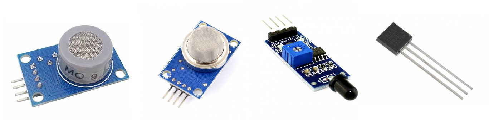
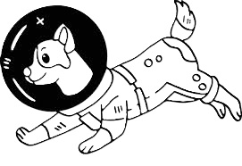

**SPOT hasičský pomocník**
==========================

*tým Laika*

Robotický pes detekující přítomnost plamene, měřící teplotu a koncentraci hořlavých plynů

----
Tento skupinový projekt vznikl v rámci předmětu ZPP *(Základy programátorské praxe)* na Fakultě aplikovaných věd ZČU

----

### Proč?

Navržený systém by měl být využitelný při záchranných operacích například při požáru, nebo úniku hořlavých či jedovatých plynů.

Cílem je hasičský asistent operovatelný z bezpečné pozice, schopen průzkumu budov a areálů, bez roskování životů členů záchranných složek.

----

### Jak?

Za použití arduino senzorů:
- MQ-9 CO senzor oxidu uhelnatého
- MQ-2 senzor hořlavých plynů propanu, metanu, butanu, vodíku
- Detekční modul plamene infračervený
- Digitální teplotní senzor DALLAS - DS18B20

napojených na desku Arduino UNO a posílající data přes WiFi z ESP8266 na webový server.
Zde jsou data přístupná uživateli.

Data zahrnují:
- koncentraci CO v ppm (částice na milion)
- koncentarci metanu v procentech
- vzdálenost od plamene v centimetrech
- Yes/No - přítomnost ohně
- teplotu v °C

----

### Kdo?

Laika je jedenáctičlenný tým studentů a studentek Softwarového inženýrství na FAV ZČU v Plzni.

- **Lucie Urbanová**
- Khongorzul Bayarsaikhan
- Ota Prokopec
- Tomáš Starý
- Vojtěch Plic
- Jakub Polák
- Jakub Urban
- Lukáš Brýla
- Nela Haasová
- Jan Chaloupka
- Lukáš Proisl

----

### Co dál?

Pro rozšíření funkcionality a tedy i aplikovatelnosti systému by bylo možné jej propojit se záběry SPOTových vestavěných kamer, nebo přidané kamery.

Dále by bylo možné jej doplnit o přijímač GPS, tak aby bylo možné jeho aktuální polohu zakreslit do mapy.

----

